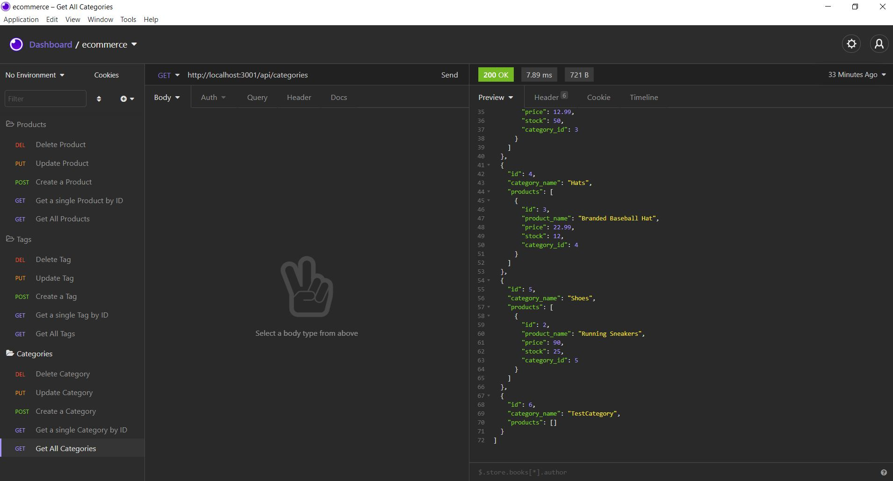

# E-commerce Back End

## Purpose

The backend for an e-commerce website that allows you to CRUD (create, read, update, delete) the Products, Categories and Tags tables.

## Built With

- JavaScript
- Node.js
- Express.js
- MySQL2
- Sequalize
- Dotenv

## Website

Link to walk-through video:
https://drive.google.com/file/d/1zFeulzCNjX1cn94UYgbACT5Qth3AO5NG/view?usp=sharing

## Contribution

Made by Archita
